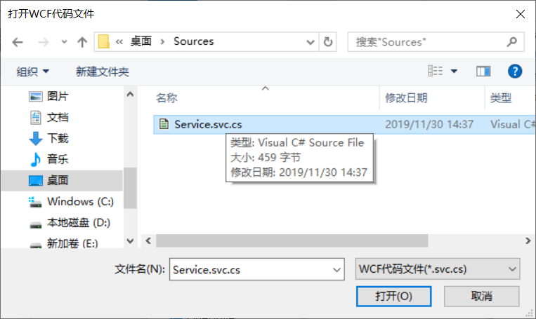

# wcf-api WCF服务转Web API
## 特性
1. 操作简单
1. 能将WCF文件及其中的方法一键转为Web API控制器文件及方法
1. 自动生成实体类及文件
## 用途
## 操作
1. 单文件程序，可复制到任一文件夹，双击直接运行  

1. 应用程序界面，可缩放，点击转换按钮即可转换  

1. 待转换WCF服务代码文件，可包括ref参数和out参数等所有功能  

1. 选择WCF服务代码文件svc.cs  

1. 选择保存的Web API控制器文件，同时保存实体类文件  

1. 生成的文件  

1. 生成的Web API控制器文件内容，已做全部转换  

## 备注
